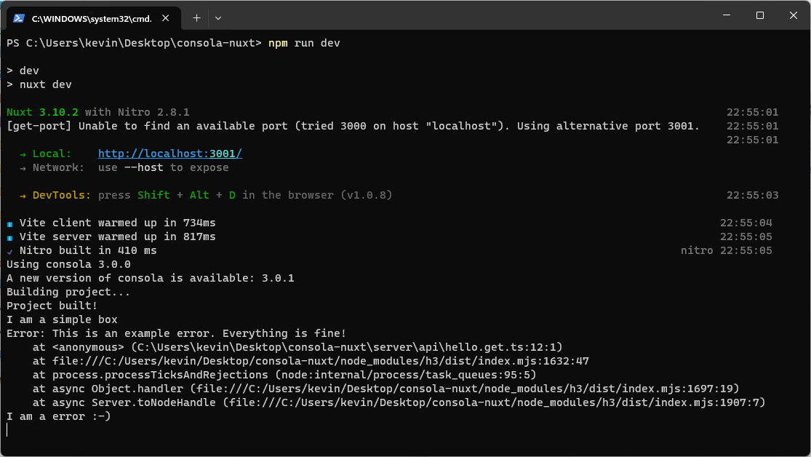

# Consola & Nuxt format issue

When using Nuxt and Consola, the desired formats are not working out-of-the box. There are no colors, date-time information, tags and so on. Important for me would be at least to have date-time information in the logs. I was unable to set the reporter to FancyReporter. It seems, that a BasicReporter is used. The fancy option mentioned in the documentation is not available / working.

Steps to reproduce:
- `npm run dev`
- navigate to http://localhost:3000/api/hello

The printed result (sample is taken from documentation) looks very simple as mentioned above. See screenshot below.

